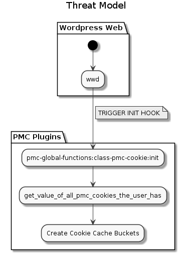
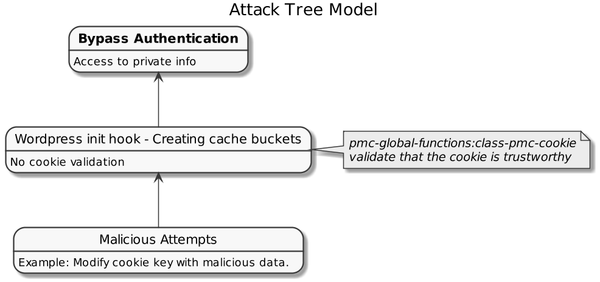

# class-pmc-cookie

In the `init` hook of WordPress we create a cache group using the `vary_cache_on_function` with all the valid cookies that belong to the `pmc cookies`.
  
## Secure Issues

- The user can change the cookie key manually using the browser console and insert malicious data. 

## Threat Model

## Attack Tree

## Plan

Validate all the cookies values that belong to the `pmc` cookies and confirm that it is not malicious.
