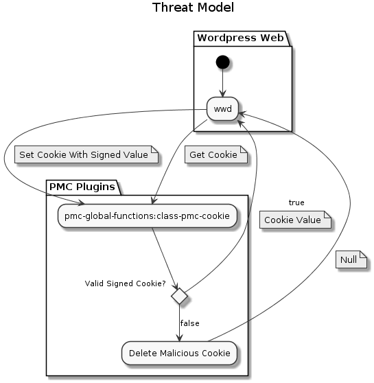
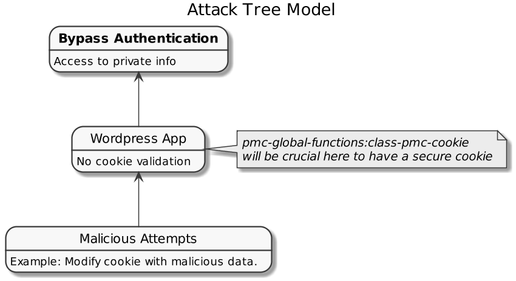

# class-pmc-cookie

With `class-pmc-cookie` we can create a signed cookie that will be validated to avoid maliciously data from the user when we get it.
  
## Secure Issues

- The user can change the cookie manually using the browser console and insert malicious data. 

## Threat Model

## Attack Tree

## Plan

Add a signed cookie that will be used to validate if the user modified the cookie, the value looks like this: `original_cookie_value.hash_of_original_cookie_value`, then whenever cookie data needs to be accessed, the original value is hashed and compared to the given hash, and if they match the cookie has not been tampered with and it's contents are trustworthy. If they do not match, treat the cookie as maliciously altered and discard it.

